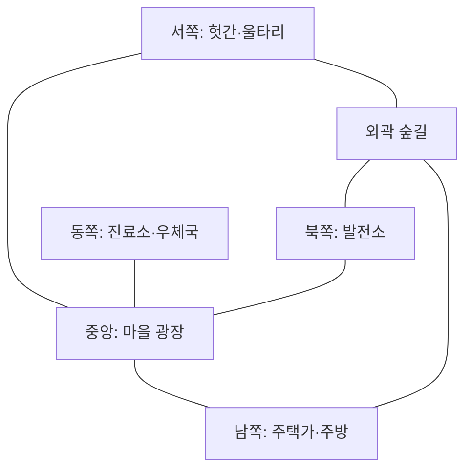

# 코어 루프 제안서

문서 버전: 0.1  
상태: **제안 — 확정 아님**

## 1. 첫 플레이테스트의 범위

첫 프로토타입은 세 모드를 동시에 만들지 않고 **마을 모드 6인 플레이**만 검증한다. 이는 출시 사양을 6인으로 고정한다는 뜻이 아니라, 가장 작은 규칙 세트로 핵심 재미를 확인하기 위한 테스트 조건이다.

검증할 핵심 질문은 세 가지다.

1. 낮의 준비가 밤의 선택을 실제로 바꾸는가?
2. 주민이 밤에 계속 움직일 이유가 있는가?
3. 아침에 말할 만한 “직접 목격한 사건”이 자연스럽게 생기는가?

## 2. 권장 가설 A: 공동 준비도

낮 임무의 결과를 개별 점수 대신 세 개의 **마을 준비도**로 축적한다.

| 준비도 | 낮 행동 예시 | 밤에 생기는 효과 |
|---|---|---|
| 전력 | 발전기 수리, 퓨즈 운반 | 가로등·건물 조명 사용 |
| 안전 | 문 수리, 경보기 설치 | 숨을 장소 또는 경보 지점 활성화 |
| 보급 | 음식 준비, 창고 정리 | 일회용 생존 도구 생성 |

장점:

- 낮과 밤의 인과관계가 직관적이다.
- 협동 목표를 한눈에 이해할 수 있다.
- 늑대가 낮에 일부러 비효율적으로 행동하면 추리 단서가 된다.

주의점:

- 단순 게이지 채우기로 느껴질 수 있다.
- 최적 루트가 고정되면 반복성이 떨어진다.

보완 가설:

- 매일 세 준비도 중 두 가지만 중요하게 만드는 **밤 예보 카드**를 공개한다.
- 임무 위치와 필요한 운반 물품을 판마다 일부 변경한다.
- 늑대에게 직접적인 파괴 버튼을 주기보다, 돕는 척 시간을 낭비할 여지를 준다.

### 대안 B: 개별 제작

각 플레이어가 낮에 재료를 모아 개인 생존 도구를 만든다.

- 장점: 개인 선택과 성취가 강하다.
- 단점: 협동 마을이라는 정체성이 약해지고 파밍 게임처럼 보일 수 있다.

### 대안 C: 건물 단위 복구

발전소, 진료소, 감시탑 중 플레이어가 직접 복구할 건물을 고른다.

- 장점: 지도 변화가 눈에 보이고 전략적 토론이 생긴다.
- 단점: 초보자에게 선택 부담이 크며 맵 제작 비용이 높다.

**첫 테스트 권장:** A. 규칙을 설명하기 쉽고 낮/밤 연결 여부를 가장 빠르게 검증할 수 있다.

## 3. 낮 임무 후보

첫 테스트에서는 입력 방식이 서로 다른 임무 세 종류만 사용한다.

| 임무 | 기본 행동 | 협동·관찰 포인트 | 연결 준비도 |
|---|---|---|---|
| 퓨즈 배달 | 한 손에 퓨즈를 들고 발전소까지 이동 | 운반 중 다른 행동 제한, 동행 가능 | 전력 |
| 울타리 수리 | 흩어진 판자를 가져와 순서대로 조립 | 두 명이면 운반과 조립 분담 | 안전 |
| 수프 준비 | 재료 그림을 기억해 주방에 넣기 | 잘못 넣은 행동이 눈에 띔 | 보급 |

설계 원칙:

- 임무 하나는 15~35초 안에 작은 진척을 준다.
- 혼자서도 할 수 있지만 둘이 하면 약간 편해진다.
- 실패보다 **누가 무엇을 했는지 목격할 수 있는 행동**을 우선한다.
- 정교한 미니게임보다 이동 경로와 플레이어 충돌에서 웃긴 상황을 만든다.

## 4. 밤의 위험-보상 구조

### 제안 A: 감소하는 준비도

밤이 시작되면 활성화된 시설이 천천히 소모된다. 주민은 숨어서 버틸 수 있지만, 일부 시설을 다시 작동시키려면 밖으로 나와 짧은 밤 임무를 해야 한다.

밤 임무 예시:

- 꺼진 가로등의 퓨즈 다시 넣기
- 울리는 경보기 수동 재설정
- 진료소에서 소모된 구급 가방 가져오기

장점:

- 주민에게 움직일 이유가 생긴다.
- 늑대가 이동 경로를 예측할 수 있어 추격이 발생한다.
- 낮에 준비한 시설이 단순 보너스가 아니라 밤 플레이 공간을 만든다.

위험:

- 임무가 강제되면 숨바꼭질의 자유가 줄어든다.
- 최적 담당자가 반복해서 희생될 수 있다.

안전장치 후보:

- 밤 임무는 생존의 필수가 아니라 다음 아침의 팀 이점에 영향을 준다.
- 같은 플레이어가 연속으로 수행하면 효율이 낮아져 자연스럽게 역할을 나눈다.
- 활성 임무 위치를 둘 이상 제시해 늑대가 한 곳만 지키지 못하게 한다.

### 대안 B: 완전 선택형 보너스

밤 임무를 하지 않아도 불이익이 없고 성공 시 단서나 아이템만 준다.

- 장점: 숨는 선택을 존중한다.
- 단점: 위험 회피가 항상 최적이 될 가능성이 높다.

### 대안 C: 무작위 위기

밤마다 화재, 정전, 문 고장 중 하나가 발생해 주민이 대응한다.

- 장점: 매 판 다른 이야기가 생긴다.
- 단점: 운에 의해 승패가 흔들리고 규칙 학습이 어려울 수 있다.

**첫 테스트 권장:** A를 사용하되 실패는 즉시 패배가 아니라 다음 낮의 불리함으로 연결한다.

## 5. 숨기 시스템 비교

### 제안 A: 물리 공간에 숨기

침대 밑, 건초 더미, 옷장처럼 지도에 보이는 장소에 들어간다. 장소마다 한 명만 숨을 수 있고, 들어가거나 나올 때 짧은 소리와 애니메이션이 발생한다.

- 장점: 매우 직관적이며 귀여운 연출을 만들기 쉽다.
- 단점: 늑대가 장소를 전부 순회하면 단순 수색 게임이 될 수 있다.

필요한 보완:

- 모든 숨기 장소를 매번 활성화하지 않는다.
- 숨은 플레이어는 제한된 시야로 주변 소리를 듣는다.
- 장시간 같은 장소에 있으면 재채기·뒤척임 같은 약한 위험 신호가 발생한다.
- 늑대의 수색에는 짧은 시간 비용을 둔다.

### 대안 B: 어둠과 시야로 숨기

별도 상호작용 없이 조명 밖이나 장애물 뒤에서 시야를 끊는다.

- 장점: 추격 중 즉흥적인 숨기가 가능하다.
- 단점: 네트워크 지연과 카메라 각도에 따라 판정 불만이 생길 수 있다.

### 대안 C: 변장 오브젝트

주민이 상자나 화분 같은 오브젝트로 잠시 변장한다.

- 장점: 파티 게임다운 코미디가 강하다.
- 단점: 세계관과 추리의 진지한 긴장감을 약화할 수 있다.

**첫 테스트 권장:** A를 기본으로 하고, 조명 밖에서 발견 거리가 짧아지는 B의 일부만 결합한다.

## 6. 역할 능력 후보

모든 능력은 **정보 또는 선택의 폭을 조금 늘리되 정답을 직접 알려주지 않는 것**을 기준으로 한다.

### 수리공

| 후보 | 효과 | 장점 | 위험 |
|---|---|---|---|
| A. 응급 수리 | 밤에 시설 하나를 짧게 임시 복구 | 낮/밤 연결이 명확함 | 시설 의존도가 높아짐 |
| B. 공구 가방 | 운반 없이 수리 1회를 수행 | 이해하기 쉬움 | 단순 속도 보너스에 가까움 |
| C. 상태 진단 | 다음에 고장 날 시설을 미리 확인 | 팀 의사결정 생성 | 정보 공유가 강제됨 |

첫 테스트 후보: **A. 응급 수리**, 게임당 1회 가설.

### 의사

| 후보 | 효과 | 장점 | 위험 |
|---|---|---|---|
| A. 보호 붕대 | 미리 지정한 주민이 첫 공격 후 부상 상태로 탈출 | 추격을 연장함 | 대상 지정 메타가 생김 |
| B. 현장 치료 | 부상자를 일정 시간 치료 | 협동 장면 생성 | 늑대가 치료 장소를 지킬 수 있음 |
| C. 진정제 | 주민 한 명의 소음 흔적을 잠시 줄임 | 숨기와 직접 연결 | 효과 체감이 약할 수 있음 |

첫 테스트 후보: **B. 현장 치료**. 늑대의 공격을 즉시 탈락이 아닌 부상 단계와 연결할 때만 사용한다.

### 보안관

| 후보 | 효과 | 장점 | 위험 |
|---|---|---|---|
| A. 흔적 감식 | 지정 구역의 최근 발자국 방향을 확인 | 목격 기반 추리를 강화 | 정체를 너무 쉽게 밝힐 수 있음 |
| B. 봉인등 | 구역 하나의 통과 기록만 아침에 확인 | 토론 근거 생성 | 설명이 추상적일 수 있음 |
| C. 사건 기록 | 아침에 공격 발생 시간대와 대략 위치 확인 | 거짓말 검증에 도움 | 능동 플레이가 적음 |

첫 테스트 후보: **A. 흔적 감식**. 동물/색상은 표시하지 않고 이동 방향과 흔적의 신선도만 보여준다.

### 늑대

| 후보 | 효과 | 장점 | 위험 |
|---|---|---|---|
| A. 냄새 맡기 | 가까운 이동 중 주민의 대략 방향 감지 | 캠핑보다 추격 유도 | 지나치게 정확하면 숨기 무력화 |
| B. 울부짖기 | 짧게 주민 소리를 유발하지만 늑대 위치도 노출 | 큰 파티 순간 생성 | 복잡하고 강력함 |
| C. 도약 | 짧은 거리 돌진 | 조작 재미가 명확함 | 액션 실력 비중이 커짐 |

첫 테스트 후보: **A. 냄새 맡기**. 정지해 숨은 주민은 감지하지 않고, 최근 움직인 주민의 흔적만 흐릿하게 표시한다.

## 7. 공격과 탈락 처리 비교

### 제안 A: 건강 → 부상 → 실종

- 첫 공격: 부상. 이동 속도와 소음에 작은 불이익을 받지만 도망칠 기회가 있다.
- 두 번째 공격: 해당 밤 동안 실종 처리.
- 아침: 실종자가 발견되며 이후 처리 방식은 별도 결정한다.

장점:

- 한 번의 기습으로 즉시 플레이가 끝나는 좌절을 줄인다.
- 의사와 동료 구조 플레이가 자연스럽게 생긴다.
- 추격이 더 길어져 코믹한 장면이 발생한다.

단점:

- 늑대가 한 명을 잡는 데 시간이 많이 걸릴 수 있다.
- 부상자 추격이 사실상 확정 사냥이 되지 않도록 탈출 수단이 필요하다.

### 대안 B: 한 번에 포획

늑대가 주민을 잡아 굴로 운반하고, 동료가 제한 시간 안에 구출한다.

- 장점: 협동 구출 장면이 강하다.
- 단점: 캠핑과 반복 구출 문제가 생길 수 있다.

### 대안 C: 즉시 탈락

- 장점: 규칙이 단순하고 늑대의 성취감이 크다.
- 단점: 초반 탈락자의 대기 시간이 길고 파티 게임 톤과 충돌할 수 있다.

**첫 테스트 권장:** A. 단, 실종 이후 관전 방식은 첫 테스트에서 단순 관전으로 두고 유령 시스템은 별도 검증한다.

## 8. 임시 승리 조건 후보

### 마을 모드

제안:

- 주민 승리: 늑대를 모두 투표로 추방하거나, 정해진 마지막 아침까지 주민이 한 명 이상 생존하고 누적 마을 목표를 완수한다.
- 늑대 승리: 생존 늑대 수가 생존 주민 수 이상이 되거나, 마지막 밤 종료 시 마을 목표가 미달한다.

장점:

- 주민이 투표만 기다리지 않고 임무를 수행할 이유가 있다.
- 늑대는 사냥과 낮의 위장 플레이를 모두 고려해야 한다.

위험:

- 승리 조건이 두 갈래라 초보자가 복잡하게 느낄 수 있다.
- 마을 목표 수치가 너무 높으면 늑대의 방해 없이도 주민이 패배한다.

대안:

- 주민은 늑대 추방만으로 승리하고 임무는 밤 생존만 돕는다.
- 주민은 누적 목표 달성만으로 승리하고 투표는 늑대 수를 줄이는 수단으로만 사용한다.

첫 플레이테스트에서는 **이중 승리 조건**을 비교하되, UI에는 현재 가장 가까운 목표 하나를 크게 표시한다.

## 9. 임시 라운드 구성

아래 수치는 밸런스 확정값이 아니라 테스트 시작점이다.

| 구간 | 제안 시간 | 목적 |
|---|---:|---|
| 첫 낮 | 150초 | 지도 학습, 준비도 축적, 행동 관찰 |
| 밤 | 100초 | 숨기·밤 임무·추격 |
| 결과 확인 | 15초 | 사건 정보 공유 준비 |
| 토론 | 60초 | 목격 내용 압축 공유 |
| 투표 | 20초 | 빠른 결정 |
| 이후 낮 | 120초 | 반복 템포 단축 |

첫 테스트는 최대 3일로 제한한다. 예상 한 판 길이는 역할 공개와 결과 화면을 포함해 약 12~16분이다.

비교할 대안:

- 2일: 빠르지만 추리 정보와 반전 기회가 부족할 수 있다.
- 4일: 서사가 풍부하지만 초반 탈락자의 대기 시간이 길어진다.

## 10. 첫 맵 구조 가설

첫 맵은 원형 마을 광장을 중심으로 5개 구역이 연결되는 소형 구조를 권장한다.

설계 목적:

- 중앙은 빠르지만 목격되기 쉬운 길이다.
- 외곽은 어둡고 숨기 좋지만 이동 시간이 길다.
- 각 주요 목적지에 최소 두 개의 진입 경로를 둔다.
- 막다른 길은 강한 보상이나 숨기 장소가 있을 때만 사용한다.
- 늑대가 한 지점만 지켜도 모든 임무를 막을 수 없게 한다.

## 11. 당장 확정하지 않을 것

- 정식 출시 인원별 정확한 역할 배분
- 메타 재화와 액세서리 가격
- 랭크 또는 경쟁 모드
- 새로운 역할 추가
- 대규모 맵과 다수의 환경 이벤트
- 유령의 능동적 개입

코어 루프가 재미있다는 증거가 생기기 전에는 콘텐츠 양보다 상호작용의 질을 우선한다.
