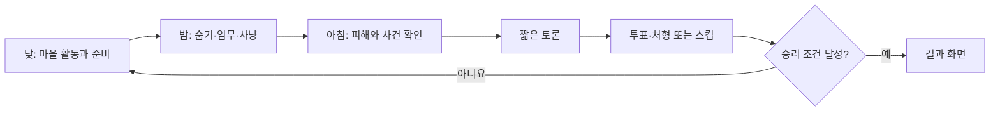

# 게임 기획 기준서

문서 버전: 0.1  
상태: 프리프로덕션 기준선

## 1. 한 줄 소개

**Little Village: Nightfall**은 낮에는 함께 마을을 준비하고, 밤에는 주민으로 숨어 살아남거나 늑대로 사냥하며, 아침에는 실제 목격을 근거로 짧게 추리하는 귀여운 동물 멀티플레이 파티 게임이다.

## 2. 플레이 경험의 약속

플레이어에게 다음 경험을 제공하는 것을 목표로 한다.

1. 친구의 수상한 움직임을 직접 보고 의심하는 재미
2. 낮에 한 선택이 밤의 생존 방식으로 이어지는 재미
3. 숨을지, 위험을 감수하고 움직일지 매 순간 판단하는 긴장감
4. 실패하거나 잡히는 순간에도 웃을 수 있는 코믹한 연출
5. 외형만 보고도 “파란 펭귄”, “노란 오리”처럼 서로를 쉽게 부르는 경험

## 3. 확정된 디자인 원칙

### 3.1 게임 정체성

- PC(Steam) 우선의 멀티플레이 파티 게임이다.
- 숨바꼭질, 소셜 디덕션, 협동 생존, 캐주얼 액션을 결합한다.
- 전통적인 마피아 게임의 긴 토론보다 실시간 이동·숨기·추격·생존을 중심에 둔다.
- 공포와 잔혹함보다 귀엽고 코믹한 분위기를 지향한다.
- 경쟁적인 e스포츠보다 친구들과 여러 판 반복하는 경험을 지향한다.

### 3.2 캐릭터와 식별

- 플레이어 캐릭터는 귀여운 동물이다.
- 동물 종류에는 능력 차이가 없다.
- 같은 방에서 동물과 색상은 각각 중복 선택할 수 없다.
- 액세서리는 중복 선택할 수 있다.
- 플레이어 외형은 `동물 + 색상 + 액세서리` 조합으로 구성한다.

### 3.3 낮과 밤

- 낮에는 마을 임무를 수행한다.
- 낮의 행동은 밤의 환경 또는 선택지에 영향을 준다.
- 밤에는 늑대가 사냥하고 주민은 숨거나 위험을 감수해 행동한다.
- 밤의 사건은 다음 아침의 추리 근거가 된다.

### 3.4 역할

- 역할은 일반 주민, 수리공, 의사, 보안관, 늑대로 구성한다.
- 일반 주민과 늑대는 필수다.
- 수리공, 의사, 보안관은 방장이 켜고 끌 수 있다.
- 특수 직업 수는 제한하며 일반 주민이 일정 비율 이상 존재하게 한다.
- 역할은 플레이 스타일을 바꾸되 능력 하나로 승패를 지배해서는 안 된다.
- 게임 시작 직후 자신의 역할만 공개한다.

### 3.5 게임 모드

- **마을**: 4~12인 메인 모드. 낮/밤, 협동 임무, 추격, 추리, 토론, 투표를 포함한다.
- **감염자**: 잡힌 주민이 탈락 대신 늑대로 변하는 빠른 액션 중심 모드다.
- **밤사냥**: 긴 토론을 제거한 숨바꼭질·추격 중심 모드이며 2인 플레이 지원을 목표로 한다.

## 4. 메인 모드의 확정 흐름

## 5. 설계 가드레일

새 아이디어는 아래 질문을 통과해야 한다.

- 실시간 숨바꼭질과 추격의 재미를 강화하는가?
- 낮의 행동과 밤의 결과를 연결하는가?
- 다른 플레이어가 관찰하고 추리할 단서를 만드는가?
- 귀엽고 코믹한 톤을 유지하는가?
- 역할 능력 없이도 기본 행동만으로 기여할 수 있는가?
- 탈락하거나 뒤처진 플레이어의 대기 시간을 과도하게 늘리지 않는가?
- 반복 플레이에서 매번 다른 이야기를 만들 수 있는가?

하나 이상의 핵심 질문에 명확히 답하지 못하는 기능은 우선순위를 낮춘다.

## 6. 미정 항목

아래 내용은 아직 확정하지 않는다.

- 각 특수 직업의 정확한 능력과 수치
- 늑대의 이동·추적·사냥 능력
- 인원별 늑대와 특수 직업 수
- 낮과 밤의 구체적인 임무
- 숨기와 추적 시스템
- 주민 생존 아이템
- 사망·탈락 및 유령 시스템
- 각 모드의 정확한 승리 조건과 세부 규칙
- 낮/밤 시간, 하루 반복 횟수
- 첫 맵 구조
- 캐릭터와 액세서리 획득 방식

이 항목은 [코어 루프 제안서](CORE_LOOP_PROPOSAL.md)의 비교안을 테스트한 뒤 하나씩 결정한다.
